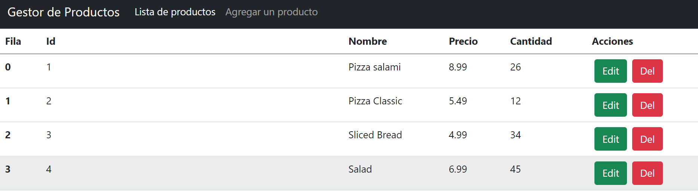

# Todo with sweet alert and node api

---

### Description
A TODO kind app, using an api made with node. Using Sweet Alert for the popus.

[API - Node - Repository](https://github.com/federocky/API-Node-Express)

---

## Use

Get the backend node api from the link above. Install npm i and node index.js to have the api running.
To run the angular application clone the repo, run npm install to get the needed packages and ng serve -o to run it in a local server.

---

## Technologies

- Angular
- Type Script
- Node
- Sweet Alert
- Bootstrap

---
## Author Info

- Linkedin - [Federico Andrés Jácome Castañeda](https://www.linkedin.com/in/federicojacome/)
- Website - [Portfolio](http://fedeandresdeveloper.online/)

[Back To The Top](#read-me-template)
